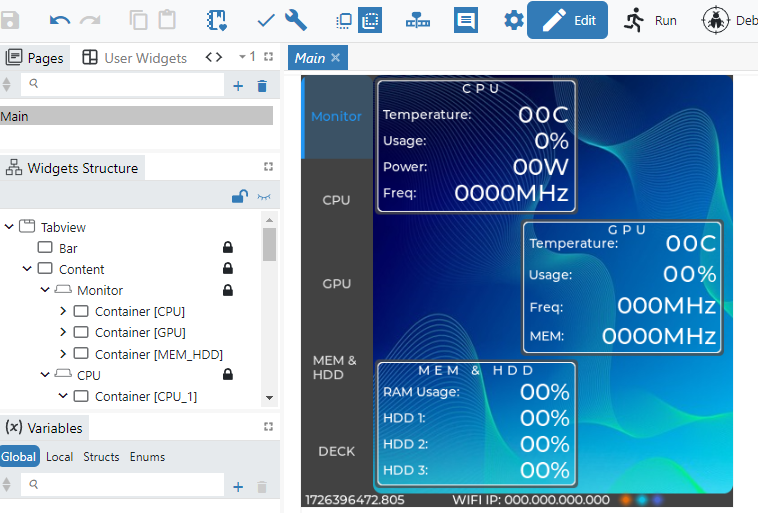
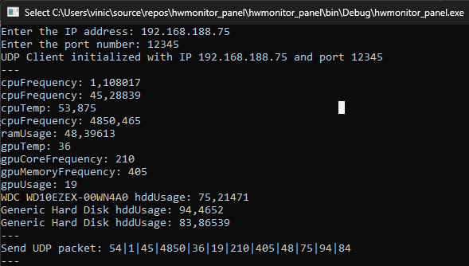
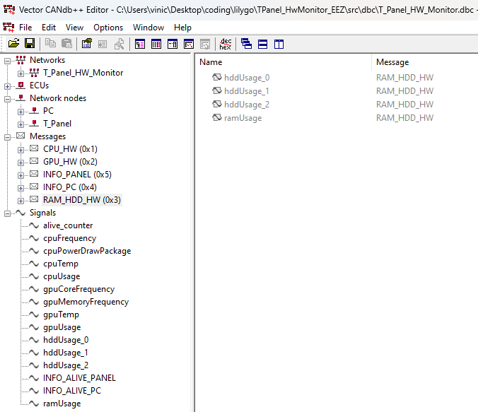
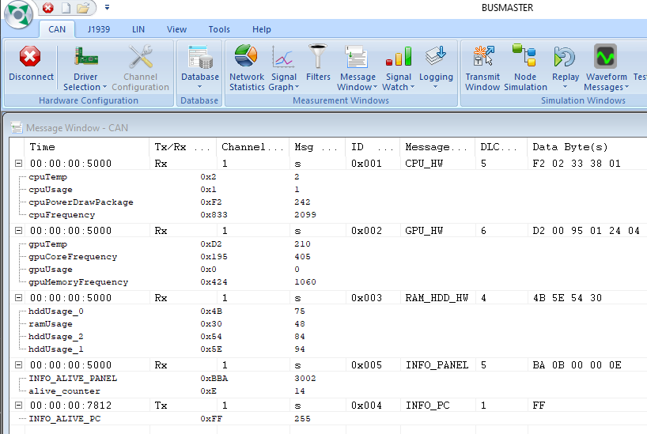
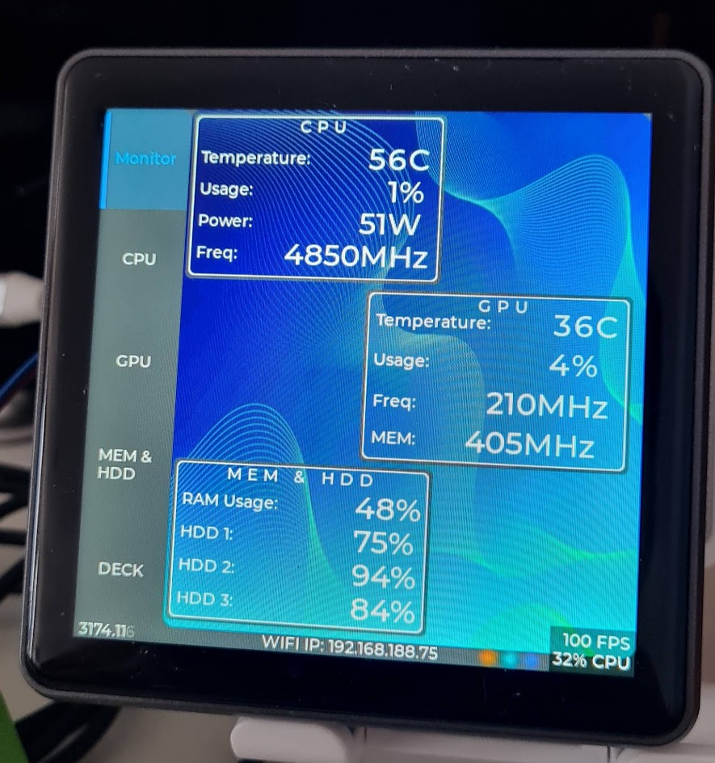

# T-PanelS3_Example

# Simple T-Panel S3 CANFD Example

This repository provides a simple example of using the [T-Panel S3](https://www.lilygo.cc/en-pl/products/t-panel-s3?variant=44273605509301) with CAN, showcasing how to interface with the panel using **EEZ Studio** and **LVGL 8.3** for graphical display, how to utilize a CAN DBC file for CAN bus communication and WIFI UDP.

## Features

- **LVGL 8.3 Integration**: This example demonstrates how to use LVGL 8.3 for creating a user interface on the T-Panel S3 by using EEZ Studio.
- **CAN DBC to Source Code Conversion**: The CAN DBC file is created using **Vector CANdb++** and converted into source code using [coderdbc](https://coderdbc.com/).
- **Computer Data Monitoring via CAN**: The project uses [openhardwaremonitor](https://github.com/openhardwaremonitor/openhardwaremonitor) to read computer data (e.g., CPU temperature, load, etc.) and transfer it over WIFI UDP to the T-Panel S3. The panel forwards this data via CAN bus.

## Setup

### Hardware
- T-Panel S3 (with built-in CANFD support)
- CAN bus setup
- Computer with **openhardwaremonitor**
- CAN Analyser (e.g PCAN, viewtool, etc.)

### Software

1. **EEZ Studio**: Used to create the UI interface for the T-Panel with **LVGL 8.3**.
2. **Vector CANdb++**: To create the CAN DBC file.
3. **coderdbc**: For converting the DBC file to usable source code.
4. **openhardwaremonitor**: To monitor the computer's hardware parameters and send them via WIFI to the T-Panel.

### Steps

1. **UI Creation**:
   - Design the graphical interface using **EEZ Studio**.
   - Deploy it to the T-Panel with **LVGL 8.3** support.

2. **CAN DBC Setup**:
   - Create the CAN DBC file using **Vector CANdb++**.
   - Convert the DBC file to C/C++ source code using **coderdbc**.

3. **Data Transfer**:
   - Set up **openhardwaremonitor** to read system information.
   - Send data over WIFI UDP to the T-Panel.
   - Forward the data over CAN bus using the generated code.

## Usage

+ Make sure you have openhardwaremonitor installed (and DLL).
+ Update TPanel_HwMonitor_EEZ.ino with your WIFI ssid/password.
+ Initialize hwmonitor_panel with your WIFI UDP IP and Port.
  + Enter the IP address: 192.168.188.75
  + Enter the port number: 12345
  + UDP Client initialized with IP 192.168.188.75 and port 12345
+ Connect your CAN bus analyser (e.g BUSMASTER, PCAN, etc.).

